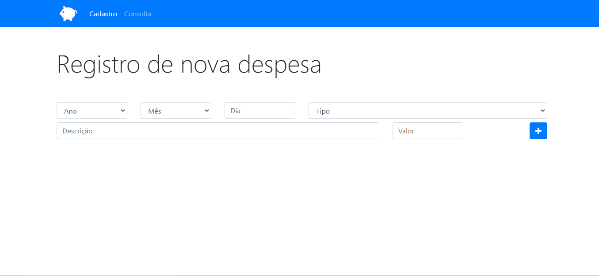
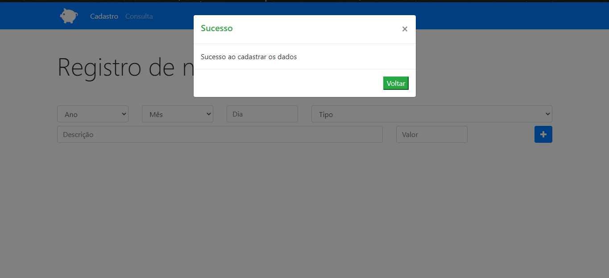
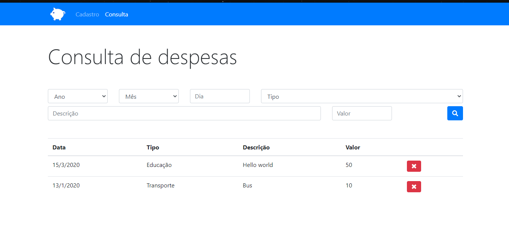
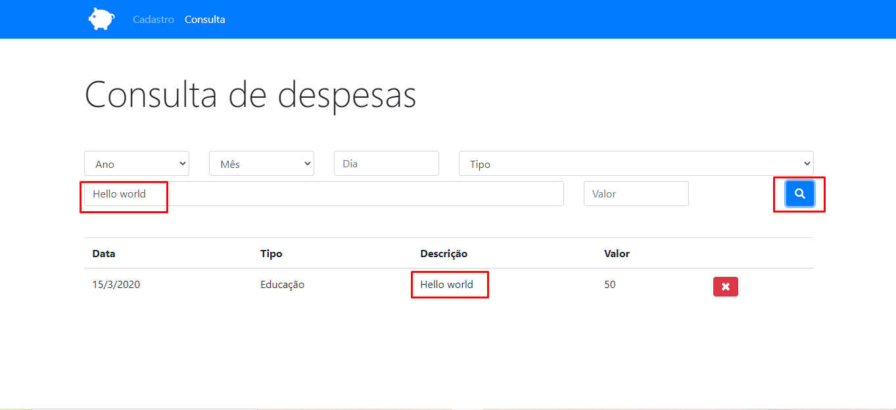

<h1 align=center>Orçamento Pessoal :moneybag:</h1>

<h2> O que é ? <h3> Um site fictício para salvamento de gastos e despesas</h2>

Desenvolvido no curso Desenvolvimento Web Completo com o Jamilton Damasceno :ghost: [link](https://docs.pipz.com/central-de-ajuda/learning-center/guia-basico-de-markdown#open)

# Sobre o projeto :mag:
Uma aplicação para você cadastrar as suas despesas pessoais e salvar no seu navegador através da tecnologia de LocalStorage disponibilizada nas novas versões dos navegadores.
  

## Telas 

    
    
    
    

                                                                    
# Principais aprendizados :bow:
* LocalStorage
* Programação Orientada a Objetos + Imperativo

# Tecnologias e frameworks
## Front end :memo:
- HTML
- CSS
- Javascript
- BOOTSTRAP 4

# Como executar o projeto
## Clonar o repositório na sua máquina. 
### Em seguida startar a aplicação no SRC/index.html 
# Autor
Lazaro Jose da Silva de Souza  
Estudante de Análise e Desenvolvimento de Sistemas pela UNINABUCO na modalidade EAD 
Entusiasta na arte de aprender algo do zero 
https://www.linkedin.com/in/lazarok09
## Aprenda a usar o [markdown](https://docs.pipz.com/central-de-ajuda/learning-center/guia-basico-de-markdown#open) no seu GitHub
## Use [emojis](https://github.com/ikatyang/emoji-cheat-sheet) no seu readme :P

< / :heart: >

